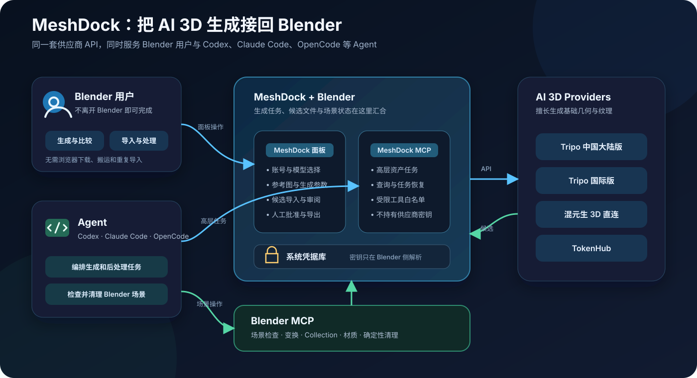

# MeshDock

> 在 Blender 里直接生成 AI 3D 模型，也让 Codex、Claude Code、OpenCode 等 Agent 用上同一套工作流。

LLM 逐点逐面建模又慢又难以控制质量；AI 3D 网页生成更快，却要反复上传、等待、下载和导入，也很难接入 Agent 工作流。

MeshDock 把这段流程放回 Blender：

- 直接调用 Tripo、混元和 TokenHub，无需来回切换浏览器；
- 生成完成后自动下载并导入，多个模型会按尺寸排开；
- 账号、模型、视角数和参数会根据供应商能力自动适配；
- 内置受限的本机 MCP，Agent 可以生成和处理模型，再配合 Blender MCP 整理场景。



## 工作方式

1. 在 Blender 中选择生成方式、账号和模型。
2. 输入提示词，或添加单张、多视角参考图。
3. MeshDock 提交任务、跟踪进度并立即下载结果。
4. 所有结果自动进入独立 Collection；多个模型会横向排列。
5. 直接保留、编辑或删除场景中的模型。

Agent 使用 MeshDock MCP 处理“生成什么”，使用 Blender MCP 处理“导入后怎么改”。MeshDock 不提供任意 Python、逐顶点遥控或密钥读取接口。

## 主要能力

- 文本、单图和多视图生成；
- Tripo 中国大陆版与国际版、混元直连、TokenHub 中国站与国际站；
- 多账号管理、费用预估与上限、暂停、恢复和重试；
- 自动下载、隔离 Collection 导入和按包围盒自动排列；
- 供应商支持范围内的重拓扑、UV、纹理、分件、格式转换、绑定和动画；
- 低模模式与面数上限，提交前由 adapter 再次校验；
- GLB、glTF、FBX、OBJ、STL 和 USD 格式；
- Windows Credential Manager、macOS Keychain 和 Linux Secret Service；
- 简体中文与英文 Blender UI。

## 供应商支持

| 服务     | 生成               | 后处理                                   |
| -------- | ------------------ | ---------------------------------------- |
| Tripo    | 文本、单图、多视图 | 重拓扑、纹理、分件、转换、绑定、动画     |
| 混元     | 文本、单图、多视图 | —                                        |
| TokenHub | 文本、单图、多视图 | 重拓扑、UV、纹理、分件、转换、绑定、动画 |

精确的模型、视角和格式限制见 [供应商兼容矩阵](docs/PROVIDER_COMPATIBILITY.md)。供应商接口和计费可能变化，生成前请检查界面预估和官方控制台余额。

## 安装

要求 Blender 5.2+；MCP sidecar 要求 Python 3.11+。

### 让 Agent 安装

把本仓库地址发给 Codex、Claude Code 或 OpenCode，请它安装 Blender 扩展并配置 MCP sidecar：

```text
https://github.com/shalomwang/meshdock-blender
```

### 从 Release 安装

1. 下载 `meshdock-0.9.7.zip`。
2. 打开 Blender 的 `Edit > Preferences > Extensions`。
3. 选择 `Install from Disk` 并安装 ZIP。
4. 在 3D View 按 `N`，打开 `MeshDock` 页签。

### 从源码安装

Windows 可一次安装 Blender 扩展和 MCP sidecar：

```powershell
powershell -ExecutionPolicy Bypass -File .\tools\install_windows.ps1
```

只构建 Blender 扩展：

```powershell
python tools/build_extension.py
```

## 快速开始

1. 打开 `View3D > MeshDock`，点击“管理账号”。
2. 选择服务，输入 Secret Key，并可选填写账号备注。
3. 选择生成方式、账号和模型；不兼容的选项会自动隐藏。
4. 输入提示词或添加参考图，检查质量、面数和预计费用后生成。
5. 等待模型自动进入场景，然后继续编辑或删除不需要的结果。

新账号默认保存到系统凭据库并启用。如果系统凭据库不可用，插件会明确提示账号仅在当前 Blender 会话中有效。

## MCP 配置

安装 sidecar 后，将 [示例配置](docs/codex-mcp.example.toml) 复制到可信 MCP Client 的配置中。先启动 Blender，再启动 Client。

```toml
[mcp_servers.meshdock]
command = "python"
args = ["-m", "meshdock.sidecar"]
enabled = true
```

建议为生成、重试、导入、后处理和导出保留工具审批。

## 凭据与安全

密钥不会写入 `.blend`、任务 JSON、仓库、MCP 配置或日志。MCP 只能看到供应商是否已配置，不能读取账号信息或密钥。

Blender 进程也可读取以下官方密钥环境变量：

```text
TRIPO_API_KEY
TRIPO_CN_API_KEY
TRIPO_GLOBAL_API_KEY
HUNYUAN_3D_API_KEY
HUNYUAN_DIRECT_API_KEY
TOKENHUB_API_KEY
TOKENHUB_CN_API_KEY
TOKENHUB_INTL_API_KEY
TOKENHUB_GLOBAL_API_KEY
```

建议只在启动 Blender 的专用脚本中注入环境变量，不要写入仓库或 MCP 配置。同一 OS 用户下的无限制 Shell 权限无法与该用户的环境变量和凭据形成强隔离。

## 项目边界

MeshDock 不负责：

- 特定项目的资产入库、质量审计或预算验收；
- 任意 Python、逐顶点遥控或任意 URL 下载；
- 替用户判断哪个模型应该保留；
- 在供应商没有远程取消接口时终止已提交的计费任务。

## 开发

```powershell
python -m pytest
python tools/build_extension.py
```

真实供应商测试可能产生费用，不属于默认测试。架构决策见 [ADR-0001](docs/ADR-0001-plugin-sidecar-boundary.md)，当前实现状态见 [IMPLEMENTATION_PLAN.md](docs/IMPLEMENTATION_PLAN.md)。

## License

MeshDock 采用 [MIT License](LICENSE)。
