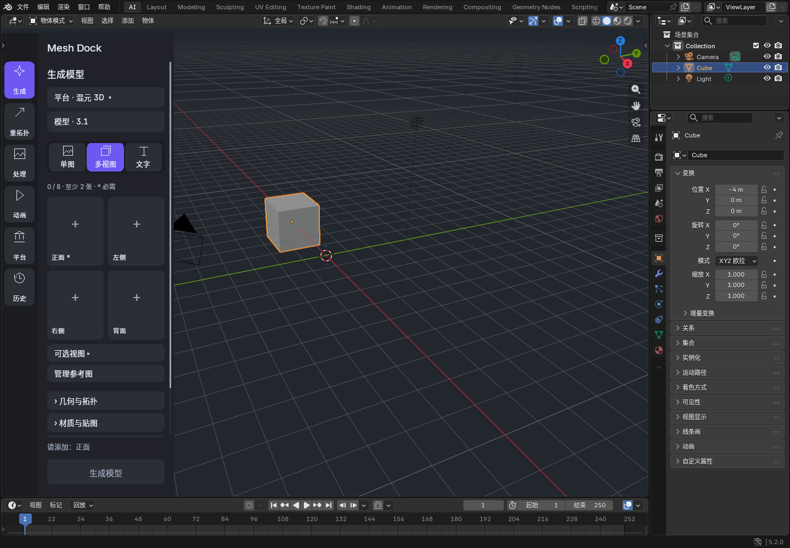

# Mesh Dock

**在 Blender 中无缝融入 AI 3D 工作流**


[](LICENSE)

[快速开始](#快速开始) · [使用说明](docs/USER_GUIDE.md) · [兼容矩阵](docs/PROVIDER_COMPATIBILITY.md) · [开发](docs/DEVELOPMENT.md)



*隔离 Blender 5.2 中的实际界面；图中未调用付费生成服务。*

## 兼容性

| 组件 | 要求 |
| --- | --- |
| Blender 扩展 | Blender 5.2 或更高版本 |
| Mesh Dock | 0.10.0 |
| MCP sidecar（可选） | Python 3.11 或更高版本 |
| 操作系统凭据库 | Windows Credential Manager、macOS Keychain 或 Linux Secret Service |

## 它能做什么

- 使用文字、单张图片或多视图图片生成 3D 模型；
- 根据平台和模型能力显示可用视图、参数、数量与费用预估；
- 生成完成后自动导入当前场景，每个结果放在独立 Collection 中；
- 对支持的生成结果或自行建模的网格执行重拓扑、UV、贴图、分件、格式转换、绑定和动画；
- 在 Blender 里查看任务进度、失败原因和生成历史；
- 让 Codex、Claude Code、OpenCode 等 Agent 通过受限的本机 MCP 使用同一套流程。

## 快速开始

### 1. 安装

1. 从 [Releases](https://github.com/shalomwang/meshdock-blender/releases) 下载 `meshdock-0.10.0.zip`。开发者也可以按下文从源码构建。
2. 打开 Blender 的 `Edit > Preferences > Extensions`。
3. 选择 `Install from Disk`，安装下载的 ZIP。
4. 在 3D View 按 `N`，打开 `Mesh Dock` 页签。
5. 点击“打开 AI 工作区”。

### 2. 添加账号

1. 在左侧选择“平台”。
2. 选择 Tripo、混元或 TokenHub。
3. 点击“获取 Key”可前往平台官方页面。
4. 添加密钥并填写容易识别的账号名称。

密钥默认保存在操作系统凭据库中，不写入 `.blend`、任务记录、MCP 配置或日志。Tripo 账号可以主动执行只读验证；其他平台会明确显示为“未验证”，请以平台控制台状态为准。

### 3. 生成模型

1. 在左侧选择“生成”。
2. 选择账号和模型。
3. 在文字、单图或多视图按钮组中选择输入方式。
4. 添加提示词或参考图片，并设置数量与可用参数。
5. 检查确认框中的平台、费用预估和输入范围，然后生成。

任务状态会显示在当前面板。完成后，模型会自动加入发起任务时的场景；生成多个结果时，每个结果保持独立，方便比较和删除。

## 供应商支持

| 服务 | 生成输入 | 可用后处理 |
| --- | --- | --- |
| Tripo | 文字、单图、多视图 | 重拓扑、贴图、分件、转换、绑定、动画 |
| 混元 3D | 文字、单图、多视图，视模型而定 | 由当前接口能力决定 |
| TokenHub | 文字、单图、多视图，视模型而定 | 重拓扑、UV、贴图、分件、转换、绑定、动画 |

界面只显示当前账号、模型和来源实际支持的选项。精确的模型、视图、格式与地区限制见 [供应商兼容矩阵](docs/PROVIDER_COMPATIBILITY.md)。平台接口和计费可能变化，提交前请检查确认框及官方控制台。

## 可选：连接 Agent

Mesh Dock 自带受限的本机 MCP sidecar，让 Agent 可以创建生成任务、查询状态和调用明确的后处理操作。它不提供任意 Python、任意文件读取、逐顶点遥控或密钥读取能力。

sidecar 要求 **Python 3.11 或更高版本**。从同一 [Release](https://github.com/shalomwang/meshdock-blender/releases) 下载可选的 `meshdock_blender-0.10.0-py3-none-any.whl`，在准备供 MCP 使用的 Python 环境中安装：

```powershell
python -m pip install .\meshdock_blender-0.10.0-py3-none-any.whl
```

将 [示例配置](docs/codex-mcp.example.toml) 复制到可信 MCP Client 的配置中，并先启动 Blender。配置中的 `python` 应指向刚才安装 sidecar 的 Python 环境。

### MCP 配置示例

```toml
[mcp_servers.meshdock]
command = "python"
args = ["-m", "meshdock.sidecar"]
enabled = true
```

## 从源码安装

Windows 可安装 Blender 扩展和 MCP sidecar：

```powershell
powershell -ExecutionPolicy Bypass -File .\tools\install_windows.ps1
```

只构建 Blender 扩展：

```powershell
python tools/build_extension.py
```

生成的安装包位于 `dist/`。

## 凭据与安全

Mesh Dock 支持 Windows Credential Manager、macOS Keychain 和 Linux Secret Service。系统凭据库不可用时，界面会提示账号只在当前 Blender 会话中有效。

也可以在启动 Blender 前设置官方密钥环境变量：

### 支持的环境变量

```text
TRIPO_API_KEY
TRIPO_CN_API_KEY
TRIPO_GLOBAL_API_KEY
HUNYUAN_3D_API_KEY
HUNYUAN_DIRECT_API_KEY
TOKENHUB_API_KEY
TOKENHUB_CN_API_KEY
TOKENHUB_INTL_API_KEY
TOKENHUB_GLOBAL_API_KEY
```

不要把密钥写入仓库、`.blend` 或 MCP 配置。同一操作系统用户下拥有无限制 Shell 权限的程序仍可能访问该用户的环境变量和凭据。

## 故障排查

| 现象 | 先检查什么 |
| --- | --- |
| 看不到 Mesh Dock | 确认扩展已启用，并在 3D View 按 `N` 打开侧栏 |
| 没有可选模型或操作 | 到“平台”确认账号已启用；模型、地区和输入方式必须互相兼容 |
| 处理按钮不可用 | 返回物体模式，选择一个网格；生成结果选择任一部件即可 |
| 任务停止后平台仍在运行 | “停止”可能只停止本地查询，请到平台控制台确认远端任务和账单 |
| 重启后无法恢复任务 | 只有已经保存远端任务编号的任务能安全恢复；插件不会自动重复提交 |

仍无法解决时，请提交 [Issue](https://github.com/shalomwang/meshdock-blender/issues)，附上 Blender 版本、Mesh Dock 版本、平台名称、操作步骤和不含密钥的错误信息。

## 开发与测试

```powershell
python -m pytest
python tools/build_extension.py
```

默认测试使用本地或模拟服务，不产生真实生成费用。真实平台测试需要单独配置账号，并可能产生费用。

项目结构、隔离 Blender 验证和发布检查见 [开发说明](docs/DEVELOPMENT.md)。

## License

Mesh Dock 使用 [MIT License](LICENSE)。
